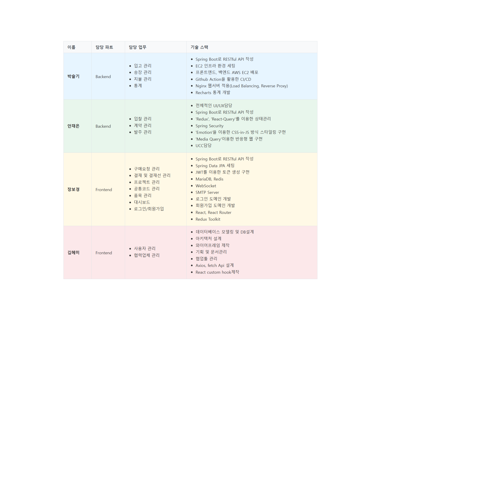

# 구매관리시스템 (Purchase Management System)


## 구매관리시스템 링크: [https://purchase-management-system.com](https://purchase-management-system.com)

## 소개 영상 보기: [UCC 링크](https://www.youtube.com/watch/LDKpw45f9QY)

## 💜 프로젝트 진행 기간
2025.02.27 ~ 2025.03.27 (30일간 진행)  
Ezen Academy K-Digital 2기 파이널 프로젝트 - 구매관리시스템

</br>

## 🎵 구매관리시스템 - 배경
현대 기업의 구매 프로세스는 복잡하고 다양한 이해관계자들이 참여하는 과정입니다. 효율적인 구매 관리와 투명한 프로세스 운영이 필요한 시점에서, 구매관리시스템은 이러한 니즈를 충족시키기 위해 탄생했습니다.

구매관리시스템은 입찰, 발주, 납품 등 구매 관련 모든 프로세스를 통합적으로 관리할 수 있는 웹 기반 애플리케이션입니다. 실시간 입찰 현황 모니터링, 자동화된 발주 프로세스, 효율적인 납품 관리 등을 통해 기업의 구매 프로세스를 최적화합니다.

</br>

## 💜 구매관리시스템 - 주요기능
---
### 1. 회원 관리
- **역할 기반 접근 제어**
  - 회사 직원과 협력업체를 구분하여 관리
  - 각 역할별 맞춤형 기능 제공
  - 보안 강화를 위한 권한 관리

- **협력업체 **
  - 입찰 참여
  - 인보이스 직접 등록 기능
  - 실시간 알림 수신

### 2. 시스템 관리
- **결재선 관리**
  - 미리 정의된 결재선 템플릿
  - 구매 요청 시 결재선 선택
  - 결재 레벨 권한 관리

- **공통 코드 관리**
  - 계층형 코드 구조 (상위/하위 코드)
  - 확장 가능한 코드 체계
  - 유지보수 용이성

### 3. 품목 마스터
  - 구매 품목 마스터 관리
  - 카테고리별 품목 관리
  - 구매 프로젝트 생성시 사용

### 4. 프로젝트 관리
- **다양한 프로젝트 유형**
  - SI (시스템 통합)
  - 유지보수
  - 컨설팅
  - 구축
  - 아웃소싱
  - 확장 가능한 분류 체계

### 5. 구매 요청 관리
  - 프로젝트와 연계
  - 결재선 연동으로 단계별 결재자 승인 처리
  - 품목 마스터 연동
  - 최종 결재자 전결로 구매 요청 완료
  - 결재 정보 통계 대시보드
  - 결재 알림 실시간 메시징

### 6. 입찰 관리
  - 구매 요청과 연계
  - 공급처 연동(협력업체)
  - 품목 마스터와 달리 공급 가격 조정 기능
  - 협력사 평가 시스템 기반 낙찰 관리

### 7. 계약 관리
  - 입찰 정보 연계계
  - 최종 낙찰 업체와 품목 공급 계약 관리
  - 전자 서명을 통한 계약
  - 계약 문서 보관 및 이력관리

### 8. 발주 관리
  - 계약 정보 연계
  - 발주서 생성 및 관리
  - 발주 승인 프로세스
  - 발주 이력 조회
  - 발주 상태 추적

### 9. 입고(납품) 관리
  - 발주 정보 연계
  - 미결재 입고발주 정보 연계
  - 입고 등록 관리
  - 인보이스(송장) 정보 연계
  - 입고 및 송장관리 대시보드

### 10. 송장관리
  - 미결재 입고 데이터 송장 자동 생성
  - 송장 상태별 관리
  - 송장 통계 대시보드

### 11. 대금지급(결제) 관리
  - 승인된 송장 정보 연계
  - 결제 통계 대시보드

### 12. 통계 및 분석
  - 월별 구매 실적 분석
  - 카테고리별 구매 현황
  - 공급업체별 구매 실적
  - 품목별 구매 추이
    
### 13. 알림 시스템
  - 입찰 참여 알림
  - 발주 승인 알림
  - 납품 요청 알림
  - 시스템 공지사항

## ✔ 주요 기술
---

**Backend - Spring**
- IntelliJ IDE
- Spring Boot 3.x
- Spring Data JPA
- Spring Security
- Spring Validation
- Spring Web
- QueryDSL
- WebSocket
- Redis 캐시 서버, 메시지 Pub/Sub
- MySQL
- JWT
- Swagger 3.0.0

**Frontend**
- Visual Studio Code IDE
- React
- Recharts
- Axios
- WebSocket
- Redux Toolkit
- React Router
- Material-UI

**CI/CD**
- Github Actions 배포 자동화
- AWS EC2
- AWS RDS
- NGINX 프록시 서버

## ✔ 프로젝트 파일 구조
---
### Back
```
purchase-management-system
  ├── src/main/java/com/orbit
  │   ├── config
  │   │   ├── WebConfig
  │   │   ├── SecurityConfig
  │   │   └── RedisConfig
  │   ├── constant
  │   │   ├── CommonConstant
  │   │   └── SystemConstant
  │   ├── controller
  │   │   ├── auth
  │   │   ├── bidding
  │   │   ├── order
  │   │   ├── delivery
  │   │   └── statistics
  │   ├── dto
  │   │   ├── request
  │   │   ├── response
  │   │   └── simple
  │   ├── entity
  │   │   ├── auth
  │   │   ├── bidding
  │   │   ├── order
  │   │   ├── delivery
  │   │   └── statistics
  │   ├── event
  │   │   ├── BiddingEvent
  │   │   └── OrderEvent
  │   ├── exception
  │   │   ├── CustomException
  │   │   └── GlobalExceptionHandler
  │   ├── repository
  │   │   ├── auth
  │   │   ├── bidding
  │   │   ├── order
  │   │   ├── delivery
  │   │   └── statistics
  │   ├── security
  │   │   ├── JwtTokenProvider
  │   │   └── SecurityFilter
  │   ├── service
  │   │   ├── auth
  │   │   ├── bidding
  │   │   ├── order
  │   │   ├── delivery
  │   │   └── statistics
  │   └── util
  │       ├── DateUtil
  │       └── StringUtil
  └── pom.xml
```
### Front
```
purchase-management-system-front
  ├── public
  │   ├── index.html
  │   └── favicon.ico
  ├── src
  │   ├── api
  │   │   ├── auth
  │   │   ├── bidding
  │   │   ├── order
  │   │   ├── delivery
  │   │   └── statistics
  │   ├── assets
  │   │   ├── images
  │   │   └── styles
  │   ├── components
  │   │   ├── common
  │   │   │   ├── Button
  │   │   │   ├── Input
  │   │   │   └── Modal
  │   │   ├── layout
  │   │   │   ├── Header
  │   │   │   ├── Sidebar
  │   │   │   └── Footer
  │   │   └── charts
  │   │       ├── BarChart
  │   │       ├── LineChart
  │   │       └── PieChart
  │   ├── hooks
  │   │   ├── useAuth
  │   │   ├── useBidding
  │   │   └── useWebSocket
  │   ├── pages
  │   │   ├── auth
  │   │   ├── bidding
  │   │   ├── order
  │   │   ├── delivery
  │   │   └── statistics
  │   ├── store
  │   │   ├── auth
  │   │   ├── bidding
  │   │   ├── order
  │   │   └── delivery
  │   ├── types
  │   │   ├── auth
  │   │   ├── bidding
  │   │   └── order
  │   ├── utils
  │   │   ├── date
  │   │   ├── format
  │   │   └── validation
  │   ├── App.tsx
  │   ├── index.tsx
  │   └── routes.tsx
  ├── package.json
  └── vite.config.ts
```

## ✔ 협업 툴
- Github
- Notion
- Gether Town

## ✔ 협업 환경
---
- 회의
  - Gether Town 아침회의 진행, 전날 목표 달성량과 당일 할 업무 브리핑
  - 각자 위치에서 건네야 할 말이 생기면 팀원의 위치로 이동하여 전달
  - 빠른 소통과 신속한 대응이 가능하다.
- Notion
  - 회의가 있을때마다 회의록을 기록하여 보관
  - 회의가 길어지지 않도록 다음날 제시할 안건을 미리 기록
  - 기술확보 시, 다른 팀원들도 추후 따라할 수 있도록 보기 쉽게 작업 순서대로 정리
  - 컨벤션 정리
  - 간트차트 관리
  - 스토리보드, 스퀀스다이어그램, 기능명세서 등 모두가 공유해야 하는 문서 관리

## ✔ 팀원 역할 분배
---


### 팀원별 역할 분배



<!DOCTYPE html>
<html lang="ko">
<head>
    <meta charset="UTF-8">
    <meta name="viewport" content="width=device-width, initial-scale=1.0">
    <title>구매관리시스템 팀원별 역할 및 기술 스택</title>
    <style>
        body {
            font-family: 'Malgun Gothic', 'Apple SD Gothic Neo', sans-serif;
            margin: 0;
            padding: 20px;
            background-color: #f8f9fa;
            color: #333;
        }
        .container {
            max-width: 1000px;
            margin: 0 auto;
            background-color: white;
            border-radius: 10px;
            box-shadow: 0 2px 10px rgba(0, 0, 0, 0.1);
            padding: 20px;
        }
        h1 {
            text-align: center;
            color: #343a40;
            font-size: 24px;
            margin-bottom: 30px;
            padding-bottom: 15px;
            border-bottom: 2px solid #e9ecef;
        }
        table {
            width: 100%;
            border-collapse: collapse;
            margin-bottom: 30px;
        }
        th, td {
            padding: 12px 15px;
            text-align: left;
            border: 1px solid #dee2e6;
        }
        th {
            background-color: #f8f9fa;
            font-weight: bold;
            color: #495057;
        }
        .name-cell {
            font-weight: bold;
            width: 80px;
        }
        .part-cell {
            width: 100px;
        }
        ul {
            margin: 0;
            padding-left: 20px;
        }
        li {
            margin-bottom: 5px;
        }
        .tech-section {
            margin-top: 30px;
        }
        .tech-section h2 {
            font-size: 18px;
            color: #495057;
            margin-bottom: 15px;
        }
        .project-info {
            background-color: #f8f9fa;
            border-radius: 5px;
            padding: 15px;
            margin-bottom: 20px;
        }
        .project-info p {
            margin: 5px 0;
        }
        tr:nth-child(1) { background-color: #e7f5ff; }
        tr:nth-child(2) { background-color: #e8f6ec; }
        tr:nth-child(3) { background-color: #fff9e6; }
        tr:nth-child(4) { background-color: #fce8ea; }
    </style>
</head>
<body>
    <div class="container">
        <h1>팀원별 역할 및 기술 스택</h1>
        
        <div class="project-info">
            <p><strong>프로젝트명:</strong> 구매관리시스템</p>
            <p><strong>프로젝트 기간:</strong> 2025.02.27 ~ 2025.03.27 (30일)</p>
            <p><strong>프로젝트 내용:</strong> Ezen Academy K-Digital 2기 파이널 프로젝트</p>
        </div>
        
        <table>
            <thead>
                <tr>
                    <th>이름</th>
                    <th>담당 파트</th>
                    <th>담당 업무</th>
                    <th>기술 스택</th>
                </tr>
            </thead>
            <tbody>
                <tr>
                    <td class="name-cell">박슬기</td>
                    <td class="part-cell">Backend</td>
                    <td>
                        <ul>
                            <li>입고 관리</li>
                            <li>송장 관리</li>
                            <li>지불 관리</li>
                            <li>통계</li>
                        </ul>
                    </td>
                    <td>
                        <ul>
							<li>Spring Boot로 RESTful API 작성</li>
                            <li>EC2 인프라 환경 세팅</li>
                            <li>프론트엔드, 백엔드 AWS EC2 배포</li>
                            <li>Github Action을 활용한 CI/CD</li>
							<li>Nginx 웹서버 적용(Load Balancing, Reverse Proxy)</li>
                            <li>Recharts 통계 개발</li>
							
                        </ul>
                    </td>
                </tr>
                <tr>
                    <td class="name-cell">안재은</td>
                    <td class="part-cell">Backend</td>
                    <td>
                        <ul>
                            <li>입찰 관리</li>
                            <li>계약 관리</li>
                            <li>발주 관리</li>
                        </ul>
                    </td>
                    <td>
                        <ul>
							<li>전체적인 UI/UX담당</li>
							<li>Spring Boot로 RESTful API 작성</li>
							<li>'Redux', 'React-Query'를 이용한 상태관리</li>							
                            <li>Spring Security</li>
                            <li>'Emotion'을 이용한 CSS-in-JS 방식 스타일링 구현</li>
                            <li>'Media Query'이용한 반응형 웹 구현</li>
                            <li>UCC담당</li>
                        </ul>
                    </td>
                </tr>
                <tr>
                    <td class="name-cell">장보경</td>
                    <td class="part-cell">Frontend</td>
                    <td>
                        <ul>
                            <li>구매요청 관리</li>
                            <li>결재 및 결재선 관리</li>
                            <li>프로젝트 관리</li>
                            <li>공통코드 관리</li>
                            <li>품목 관리</li>
                            <li>대시보드</li>
                            <li>로그인/회원가입</li>
                        </ul>
                    </td>
                    <td>
                        <ul>
							<li>Spring Boot로 RESTful API 작성</li>
							<li>Spring Data JPA 세팅</li>
							<li>JWT를 이용한 토큰 생성 구현</li>
                            <li>MariaDB, Redis</li>
                            <li>WebSocket</li>
							<li>SMTP Server</li>
							<li>로그인 도메인 개발</li>
							<li>회원가입 도메인 개발</li>
                            <li>React, React Router</li>
                            <li>Redux Toolkit</li>
                        </ul>
                    </td>
                </tr>
                <tr>
                    <td class="name-cell">김혜미</td>
                    <td class="part-cell">Frontend</td>
                    <td>
                        <ul>
                            <li>사용자 관리</li>
                            <li>협력업체 관리</li>
                        </ul>
                    </td>
                    <td>
                        <ul>
                            <li>데이터베이스 모델링 및 DB설계</li>
							<li>아키텍처 설계</li>
                            <li>와이어프레임 제작</li>
                            <li>기획 및 문서관리</li>
                            <li>협업툴 관리</li>
							<li>Axios, fetch Api 설계</li>
							<li>React custom hook제작</li>
                        </ul>
                    </td>
                </tr>
            </tbody>
        </table>
        
        <div class="tech-section">
            <h2>사용 기술 요약</h2>
            <table>
                <tr>
                    <th width="120">영역</th>
                    <th>사용 기술</th>
                </tr>
                <tr>
                    <td><strong>백엔드</strong></td>
                    <td>Spring Boot 3.x, Spring Data JPA, Spring Security, Spring Validation, Spring Web, QueryDSL, WebSocket, Redis, MySQL, JWT, Swagger 3.0.0</td>
                </tr>
                <tr>
                    <td><strong>프론트엔드</strong></td>
                    <td>React, Redux Toolkit, React Router, Material-UI, Recharts, Axios, WebSocket</td>
                </tr>
                <tr>
                    <td><strong>인프라/배포</strong></td>
                    <td>Github Actions, AWS EC2, AWS RDS, NGINX 프록시 서버</td>
                </tr>
            </table>
        </div>
    </div>
</body>
</html>